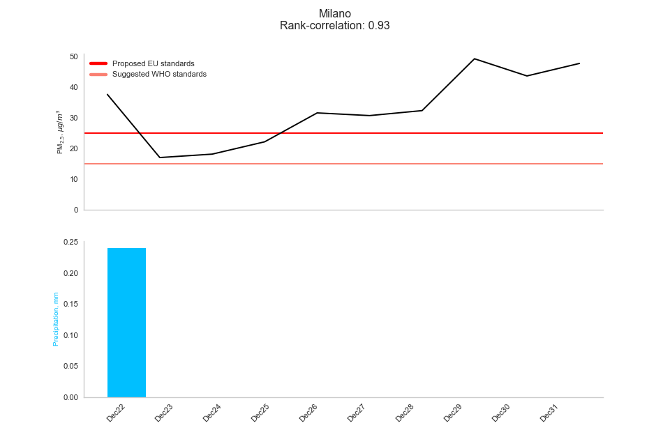
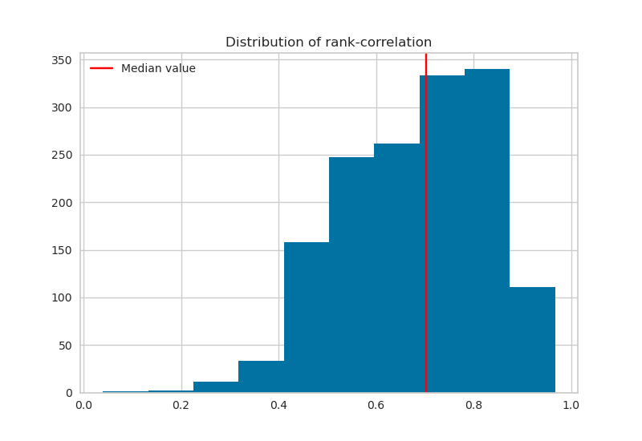

# Purpose
Livestock effluents spreading is the process of spreading liquid slurry and solid manure in livestock farming as fertilizer.  The manure is collected from the livestock barns and composted. Depending on the soil type and weather, it is possible to spread either dry or liquid manure on the field. When applied correctly, livestock effluent spreading can provide many benefits to the soil and its fertility. It can improve soil structure, make the soil more fertile, reduce soil erosion, improve water retention, and make the soil more fertile for future crops. Livestock effluent spreading has the potential to increase crop yields and improve land productivity.

The high nitrogen content makes effluents a good fertilizer; however, nitrogen can contaminate waters with undesirable results for ecosystems and human health. Excess nitrogen in water increases the risk of algal blooms, eutrophication, hypoxia, and affects the reproductive success of aquatic species. Drinking water contaminated with nitrogen can cause nausea, vomiting, and can lead to long-term health effects.

Current environmental legislation regulates the dispersal of livestock effluents to minimize the contamination of water streams with nitrogen. The regional environmental agency (ARPA Lombardia) releases a weekly (?) bulletin establishing where and when spreading is allowed on modeled and forecasted hydrological condition of the soil.

However, the dispersal of livestock effluents on fields is also responsible for up to more than 30% of the animal farming NH3 emissions in the Po Valley, Italy. Ammonia is a precursor to fine particulate matter (PM 2.5), a major airborne pollutant. At present, legislation on livestock effluents dispersal fails to consider the consequences for air pollution. The Po Valley is one of the most polluted regions in OECD countries, also due to unfavorable orography and weather patterns.

This tool is meant to support weekly bulletins on spreading effluents by forecasting PM 2.5 concentrations.

# Installation 
Download the package folder. This might take a few minutes.

```
git clone https://github.com/francescogranella/spandimentotool
```

Navigate to the directory, create a new environment and install the package:

```
conda create --name MYENV python=3.8
conda activate MYENV
cd <path-to-spandimentotool>
pip install spandimentotool
```
# Test

```
spandimento
```
# Usage

```
spandimento --input <path-to-weather-file.parquet> --code <code muncipality>
```

Takes a `.parquet` file as input with the following structure

|         | time                | lat | lon    | 10u        | 10v       | 2t      | tp         | lsm      |
|---------|---------------------|-----|--------|------------|-----------|---------|------------|----------|
| 838200  | 2019-12-21 00:00:00 | 47  | 8      | -0.0594053 | 0.824483  | 274.313 | 0.00742865 | 1        |
| 838201  | 2019-12-21 00:00:00 | 47  | 8.125  | 0.148114   | 0.886983  | 274.669 | 0.00793029 | 0.998291 |
| 838202  | 2019-12-21 00:00:00 | 47  | 8.25   | 0.160077   | 0.861348  | 276.303 | 0.00888396 | 0.877869 |
| 838203  | 2019-12-21 00:00:00 | 47  | 8.375  | -0.180743  | 0.585958  | 278.157 | 0.0101161  | 0.70636  |
| 838204  | 2019-12-21 00:00:00 | 47  | 8.5    | -0.833331  | -0.079814 | 277.771 | 0.0116363  | 0.667175 |
| ...     | ...                 | ... | ...    | ...        | ...       | ...     | ...        | ...      |
| 9721795 | 2019-12-27 18:00:00 |    44 | 11.5   | -1.13599  | -1.11962   | 275.62  | 0.000357628 |     1 |
| 9721796 | 2019-12-27 18:00:00 |    44 | 11.625 | -0.776006 | -0.552238  | 276.015 | 0.000109673 |     1 |
| 9721797 | 2019-12-27 18:00:00 |    44 | 11.75  |  0.812129 | -0.0961838 | 276.078 | 1.04904e-05 |     1 |
| 9721798 | 2019-12-27 18:00:00 |    44 | 11.875 |  0.745845 |  0.378914  | 276.079 | 5.14984e-05 |     1 |
| 9721799 | 2019-12-27 18:00:00 |    44 | 12     |  0.829707 |  0.740974  | 276.794 | 8.29697e-05 |     1 |


where 
+ `10u` : 10 metre U wind component  (m/s)
+ `10v` : 10 metre V wind component (m/s)
+ `2t` : 2 metre temperature (K) 
+ `tp` : Total precipitation (m)
+ `lsm`: Land-sea mask

## Output

The command outputs a graph with two panels. On top are the predicted concentrations, along with reference lines at 20 and 15 $\mu g/m^3$. The bottom panel displays the total precipitation in mm forecasted by ECMWF. 



The same information is save to disk in tabular form:

| date       | predicted PM2.5 | total precipitation |
| ---------- | --------------- | ------------------- |
| 2019-12-22 | 13.52           | 0.24                |
| 2019-12-23 | 10.64           | 0.0                 |
| 2019-12-24 | 16.41           | 0.0                 |
| 2019-12-25 | 18.28           | 0.0                 |
| 2019-12-26 | 34.33           | 0.0                 |
| 2019-12-27 | 41.79           | 0.0                 |
| 2019-12-28 | 49.8            | 0.0                 |
| 2019-12-29 | 49.63           | 0.0                 |
| 2019-12-30 | 45.57           | 0.0                 |
| 2019-12-31 | 47.62           | 0.0                 |

# Methods and data
`spandimentotool` is trained on weather forecast data by ECMWF over 2010-2022. For each municipality in Lombardia, a suite of estimators is trained and tested, and the best model is selected through the `pycaret` library. Models are evaluated on the rank-correlation of predictions.

## Performance


# Acknowledgements

`spandimentotool` was created by Francesco Granella and Lara Aleluia Reis under the [Impact on humaN Health of Agriculture and Liestock Emissions](https://www.eiee.org/project/inhale/) (INHALE) project funded by [Fondazione Cariplo](https://www.fondazionecariplo.it/it/index.html).  We are grateful to Stefania Renna, Jacopo Lunghi, Maurizio Malpede for useful ineractions. Damiano Di Simine and Legambiente provided insightful comments. We thank Rita Lecci (CMCC) for providing us with ECMWF data.

Queries should be addressed to francesco.granella@eiee.org.