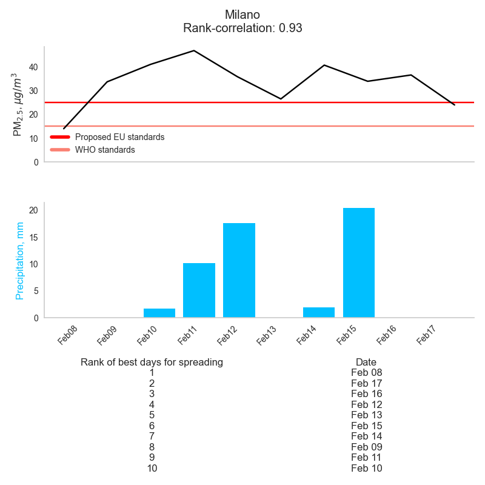

# Purpose
Livestock effluents spreading is the process of spreading liquid slurry and solid manure in livestock farming as fertilizer.  The manure is collected from the livestock barns and composted. Depending on the soil type and weather, it is possible to spread either dry or liquid manure on the field. When applied correctly, livestock effluent spreading can provide many benefits to the soil and its fertility. It can improve soil structure, make the soil more fertile, reduce soil erosion, improve water retention, and make the soil more fertile for future crops. Livestock effluent spreading has the potential to increase crop yields and improve land productivity.

The high nitrogen content makes effluents a good fertilizer; however, nitrogen can contaminate waters with undesirable results for ecosystems and human health. Excess nitrogen in water increases the risk of algal blooms, eutrophication, hypoxia, and affects the reproductive success of aquatic species. Drinking water contaminated with nitrogen can cause nausea, vomiting, and can lead to long-term health effects.

Current environmental legislation regulates the dispersal of livestock effluents to minimize the contamination of water streams with nitrogen. The regional environmental agency (ARPA Lombardia) releases a weekly (?) bulletin establishing where and when spreading is allowed on modeled and forecasted hydrological condition of the soil.

However, the dispersal of livestock effluents on fields is also responsible for up to more than 30% of the animal farming NH3 emissions in the Po Valley, Italy. Ammonia is a precursor to fine particulate matter (PM 2.5), a major airborne pollutant. At present, legislation on livestock effluents dispersal fails to consider the consequences for air pollution. The Po Valley is one of the most polluted regions in OECD countries, also due to unfavorable orography and weather patterns.

This tool is meant to support weekly bulletins on spreading effluents by forecasting PM 2.5 concentrations.

# Installation 
Download the package folder, for instance with `git clone https://github.com/francescogranella/spandimentotool`. This might take a few minutes.

Create a new environment, navigate to the directory and install the package:

```
conda create --name MYENV python=3.8
conda activate MYENV
cd <path-to-spandimentotool>
conda install --file requirements.txt
```
# Test
You can test the correct installation of the package running an example with the command:

```
spandimento
```
# Usage
Use the `municipalities` command if you wish save a list of municipalities and their code to a specified path.

```
municipalities --path <destination-path>
```

With the ISTAT code of a municipality you can query the 10-day ahead forecast for PM 2.5:
```
spandimento --input <path-to-weather-file.nc> --output <path-to-out-file.csv> --code <code muncipality>
```

The input file should be daily 10-day ahead weather forecasts by the [European Centre for Medium-Range Weather Forecasts (ECMWF)](https://www.ecmwf.int/en/forecasts) 
on a 0.1°x0.1° grid (approximately 10x10 km) covering at least the region of Lombardia and containing the following variables:

+ `U10M` : 10 metre U wind component  (m/s)
+ `V10M` : 10 metre V wind component (m/s)
+ `T2M` : 2 metre temperature (K) 
+ `precip` : Total precipitation (m)
+ `LSM`: Land-sea mask


## Output

The command outputs an image with two panels and a table. On top are the predicted concentrations, along with reference lines for the proposed EU air quality standards and for the WHO standards.
The bottom panel displays the total precipitation in mm forecasted by ECMWF. 
The table ranks the days over the forecast window for suitability for manure spreading. 
Best ranked are the days with low predicted pollution. However, days with forecasted rain are ranked last, in line with the current legislation on manure spreading. 



The same information is saved to disk in tabular form:

| date                |   predicted PM2.5 |   total precipitation |
|:--------------------|------------------:|----------------------:|
| 2022-02-08 00:00:00 |             14.03 |                  0    |
| 2022-02-09 00:00:00 |             33.73 |                  0    |
| 2022-02-10 00:00:00 |             41.06 |                  0    |
| 2022-02-11 00:00:00 |             46.85 |                  0.01 |
| 2022-02-12 00:00:00 |             35.88 |                  0.02 |
| 2022-02-13 00:00:00 |             26.54 |                  0    |
| 2022-02-14 00:00:00 |             40.74 |                  0    |
| 2022-02-15 00:00:00 |             33.96 |                  0.02 |
| 2022-02-16 00:00:00 |             36.61 |                  0    |
| 2022-02-17 00:00:00 |             24.02 |                  0    |

# Methods and data
Chemical transport models used for forecasting concentrations of air pollutants are often complex and computationally intensive. `spandimentotool` is a fast statistical model that is intended to be user friendly. It builds on machine learning to forecast concentrations of PM 2.5 over municipalities in Lombardia. 

Concentrations of PM 2.5 depend on highly non-linear interactions of its precursors and atmospheric conditions. Unfortunately, levels of emissions at a fine spatial and temporal resoltion are not available. `spandimentotool` is trained to predict PM 2.5 exploiting the dependence of concetrations on weather and predictable seasonal trends following [Granella et al. (2021)](https://iopscience.iop.org/article/10.1088/1748-9326/abd3d2). 

For each municipality in Lombardia, a suite of estimators is trained and tested, and the best model is selected through the `pycaret` library. Models are evaluated on the rank-correlation of predictions, instead of on R2, because as the ultimate goal of this tool is to forecast the most suitable days for manure spreading in a given time window, rather than the predicting concentrations. The figure below shows the distribution of the rank-correlation of predicted and observed concentrations in heldout data (i.e. that has not been used in training). The median rank-correlation is above 0.7.


Data for air pollution is collected, checked, and published by ARPA Lombardia, the regional environmental agency. We obtain readings for PM2.5 for background stations. Hourly readings are averaged to daily readings and interpolated with inverse-distance weighting to a 0.1°x0.1° grid (approximately 10x10 km).

Input weather data is daily 10-day ahead weather forecasts by ECMWF over 2016-2022. The data is in a 0.1°x0.1° grid (approximately 10x10 km) covering the region of Lombardia. Although ECMWF produces forecasts for a wide range of atmospheric conditions, in the interest of computational speed we restrict the input variables to 10-meter U and V wind components in meter/second, 2-meter temperature in Kelvin, and total precipitation in meters.

To capture seasonal trends in emissions (e.g. turning on and off of residential heating), we include calendar variables as additional predictors. More specifically, week of the year and day of the week are added in the form of continuous variables as tree-based algorithms can well discretize continuous variables.

Finally, we exclude from the training set all days in which dispersal of manure on agricultural fields was allowed. 

# Acknowledgements

`spandimentotool` was created by Francesco Granella and Lara Aleluia Reis under the [Impact on humaN Health of Agriculture and Livestock Emissions](https://www.eiee.org/project/inhale/) (INHALE) project funded by [Fondazione Cariplo](https://www.fondazionecariplo.it/it/index.html).  We are grateful to Stefania Renna, Jacopo Lunghi, Maurizio Malpede for useful interactions. Damiano Di Simine and Legambiente provided insightful comments. We thank Rita Lecci (CMCC) for providing us with ECMWF data and Laurent Drouet for helping with packaging the code.

Queries should be addressed to francesco.granella@eiee.org.

# References
Granella, F., Reis, L. A., Bosetti, V., & Tavoni, M. (2021). COVID-19 lockdown only partially alleviates health impacts of air pollution in Northern Italy. Environmental Research Letters, 16(3), 035012.